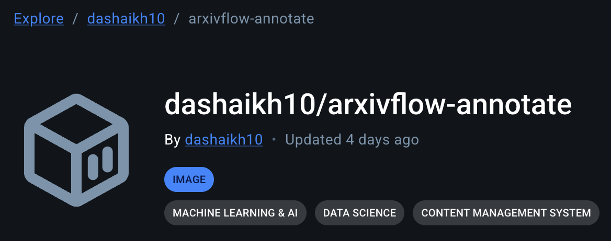

# Annotate Package

Annotate the scraped dataset using **Kubernetes** deployment of [Label Studio][label-studio-url] or **Generalist and Lightweight Model for Named Entity Recognition** ([GLiNER][gliner])

---

<div align = "center">

![Moonrepo][moonrepo-shield]
![UV][uv-shield]
![K8S][k8s-shield]
![HF Hub][gliner-hf-shield]
![Docker Image Size][arxivflow-annotate-image-shield]

</div>

<div align = "center">


</div>

---

- Spin-up a containerized instance of [Label Studio][label-studio-url] to perform annotations of the dataset.
- Deployed Label Studio instance is connected to the `arxivflow-pvc`, ready for data annotation work package.
- Alternatively, run GLiNER zero-shot NER as a K8S job.
- We are using [`urchade/gliner_large-v2.1`][gliner-hf-url] _(459M paramateric DaROBERTa based bidirectional encoder architecture model for zero-shot Named Entity Recognition)_

---

## Task Management with Moon

The project uses [Moon](https://moonrepo.dev/) as a task runner and project manager, configured efficiently via `moon.yml`.

<div align = "center">


</div>

Run standard task commands from the workspace root:

```bash
moon run annotate:TASK_NAME
```

---

## Python Management with UV

We use [uv][uv-url] to manage Python dependencies seamlessly and blazingly fast. All requirements are safely pinned down in `uv.lock`.

- **Main dependencies** _(e.g., aiofiles, gliner, wandb)_ are declared in the `[project.dependencies]` array in `pyproject.toml`.
- **Development dependencies** _(e.g., black, ruff, pylint)_ are organized explicitly within the `[dependency-groups]` under `dev` section in `pyproject.toml`.

---

## Environment Configuration

Configuration variables, secrets, and other runtime settings are loaded via an `.env` file. To set everything up correctly on a local machine, simply copy and adapt the sample file:

```bash
cp .env.example .env
```

Ensure your copied `.env` properties have real values filled in before executing any scripts.

---

## Structure

```bash
.
├── k8s/ — Kubernetes manifests
│ ├── `gliner-ner-extraction.yml` # Kubernetes job/manifest for GLiNER NER extraction
│ └── `label-studio.yml`          # Kubernetes deployment for Label Studio
├── scripts/
│ └── `clean.sh`                  # cleanup helper for local or containerized runs
├── src/
│ ├── lib/
│ │ └── ner/
│ │   ├── `__init__.py`           # package initializer for ner module
│ │   ├── `config.py`             # GLiNER configuration values
│ │   ├── `gliner.py`             # GLiNER model and NER inference logic
│ │   └── `schema.py`             # data schema for annotations
│ ├── `logs/`                     # directory for runtime logs and output artifacts
│ └── utils/
│   ├── `__init__.py`             # utilities package initializer
│   ├── `logger.py`               # logging setup and helpers
│   └── `path.py`                 # path utilities used across the package
├── `Dockerfile`                  # container image build for the annotate service(s)
├── `Dockerfile.tera`             # templated Dockerfile used by the moon build system
├── `pyproject.toml`              # Python project configuration and dependencies
└── `README.md`                   # this package README
```

---

## Dockerization & Moon `.tera` Templates

This package builds optimized, fully containerized production images using multi-stage Docker builds.

Moon is configured to scaffold our workspace using `.tera` templates (`Dockerfile.tera`). This enables Moon to programmatically construct isolated execution contexts by selectively copying specific configuration files (`pyproject.toml`, `uv.lock`) and scopes (`src/**/*`) prior to dependency resolutions. This significantly accelerates build steps using layer caching and allows pruning extraneous project files.

A minimal Python image (`python3.14-slim`) is defined directly via the template build stages to prepare dependencies before shedding development packages entirely for an optimal, lightweight runner. We cannot use `alpine` here as it has no wheel for `onnx-runtime`.

<div align = "center">

<a href="https://hub.docker.com/r/dashaikh10/arxivflow-annotate" target="_blank" rel="noopener noreferrer">
    
</a>

</div>

---

## Cluster Usage

### Label Studio

Run this to generate / update `Dockerfile` using `Dockerfile.tera` and package scaffold:

```bash
moon docker file annotate # Run from ArXivFlow workspace folder.
```

Build the ArXivFlow Annotate Docker image using the Moon template flow:

```bash
moon run annotate:dockerize # Run from ArXivFlow workspace folder.
```

Publish the latest arxiv-annotate image to DockerHub _(Running this command will run dockerize command automatically)_:

```bash
moon run annotate:publish # Run from ArXivFlow workspace folder.
```

Copy `.env` to Kubernetes cluster namespace:

```bash
kubectl create secret generic annotate-env --from-env-file=./.env
```

Start the Label Studio deployment and service:

```bash
kubectl apply -f k8s/label-studio.yml
```

Once the service is up and running, connect to it locally using the command below.
You should then be able to access your Label Studio deployment at `http://localhost:8080`

```bash
kubectl port-forward svc/label-studio 8080:8080
```

Connect to ArXivFlow PVC

<div align = "center">


</div>

### NER using GLiNER Large 2.1

Run the GLiNER model job on a suitable GPU **_(We use NVIDIA L4 Ada Lovelace GDDR6 24GB VRAM)_** or CPU with enough RAM _(12 ~ 16 GB should be enough)_

```bash
kubectl apply -f k8s/gliner-ner-extraction.yml
```

Cleanup resources _(pod, job)_ after task completion:

```bash
kubectl delete -f k8s/label-studio.yml
```

```bash
kubectl delete -f k8s/gliner-ner-extraction.yml
```

---

## Reference

```bibtex
@misc{zaratiana2023gliner,
    title         = {GLiNER: Generalist Model for Named Entity Recognition using Bidirectional Transformer},
    author        = {Urchade Zaratiana and Nadi Tomeh and Pierre Holat and Thierry Charnois},
    year          = {2023},
    eprint        = {2311.08526},
    archivePrefix = {arXiv},
    primaryClass  = {cs.CL}
}
```

<!-- REFERENCES -->

[arxivflow-annotate-image-shield]: https://img.shields.io/docker/image-size/dashaikh10/arxivflow-annotate?style=flat&label=arxivflow-annotate
[gliner]: https://urchade.github.io/GLiNER/
[gliner-hf-url]: https://huggingface.co/urchade/gliner_large-v2.1
[gliner-hf-shield]: https://img.shields.io/badge/urchade/gliner__large--v2.1-Informational?style=flat&logo=huggingface&labelColor=000&color=ffd21e
[k8s-shield]: https://img.shields.io/badge/Kubernetes-Informational?style=flat&logo=kubernetes&logoColor=326ce5&labelColor=fff&color=326ce5
[label-studio-url]: https://labelstud.io/
[moonrepo-shield]: https://img.shields.io/badge/Moonrepo-Informational?style=flat&logo=moonrepo&labelColor=fff&color=%236f53f3
[uv-shield]: https://img.shields.io/badge/UV-Informational?style=flat&logo=uv&labelColor=fff&color=%23de5fe9
[uv-url]: https://github.com/astral-sh/uv
