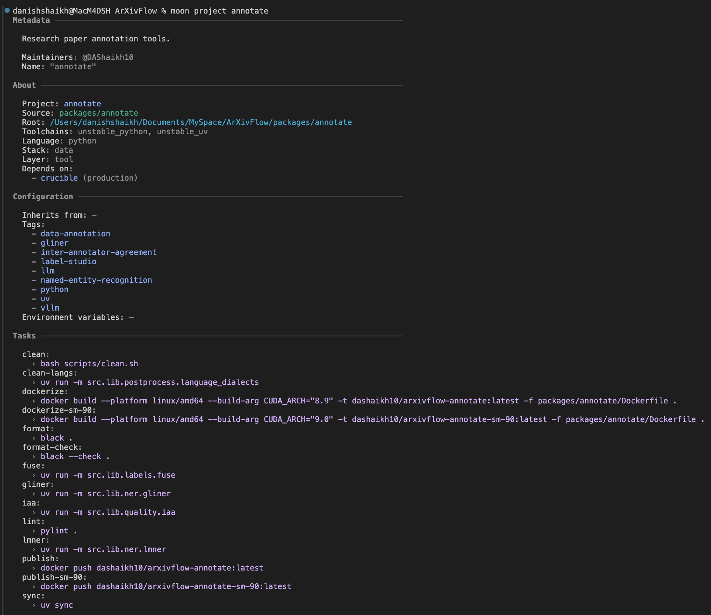
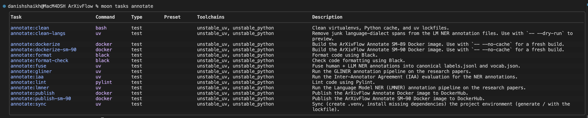
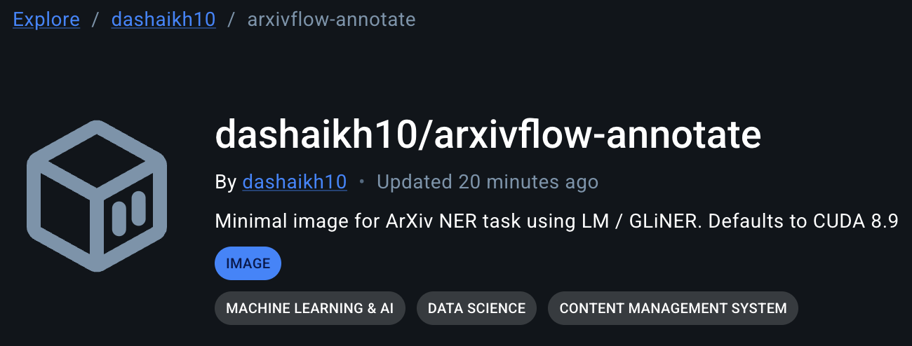
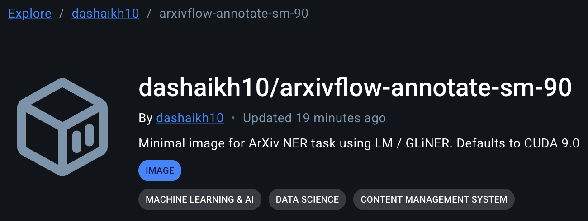
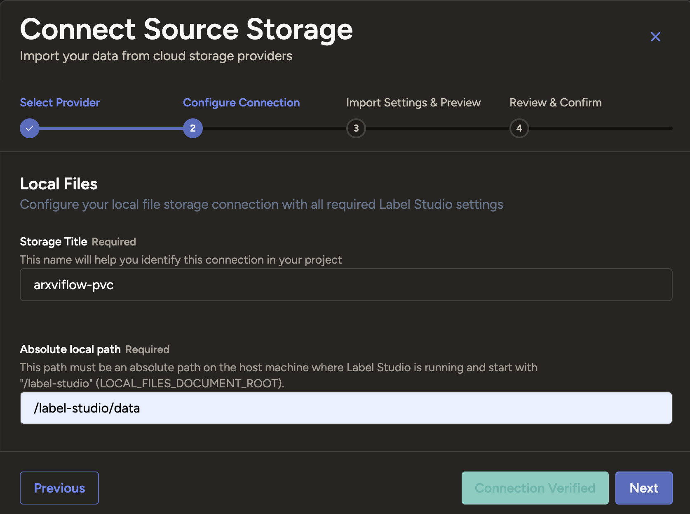
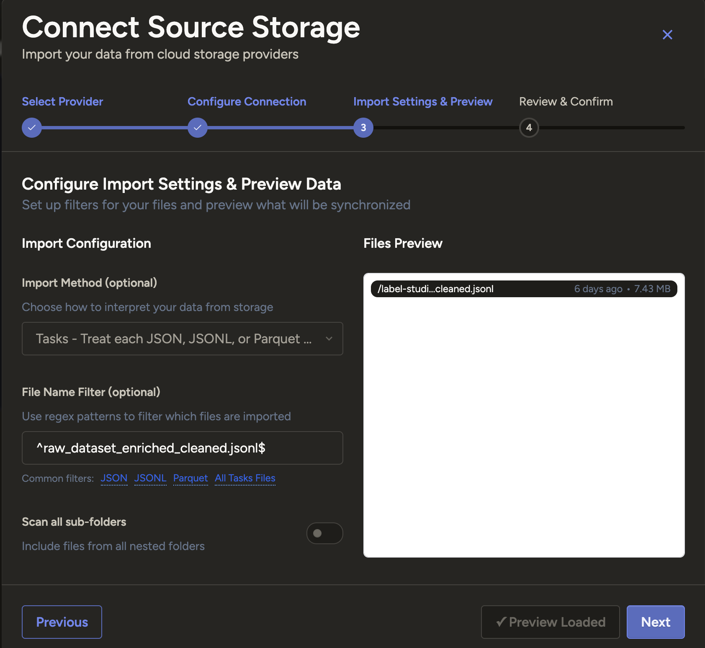
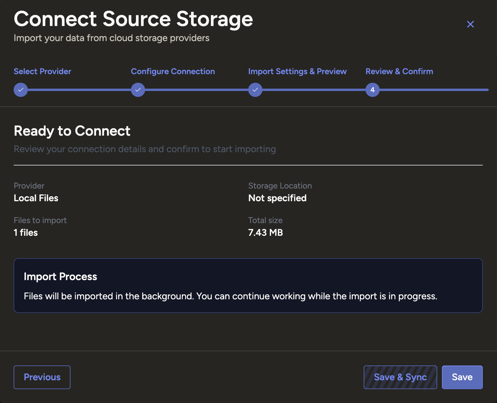
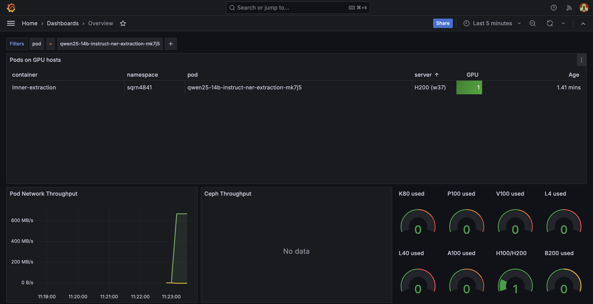
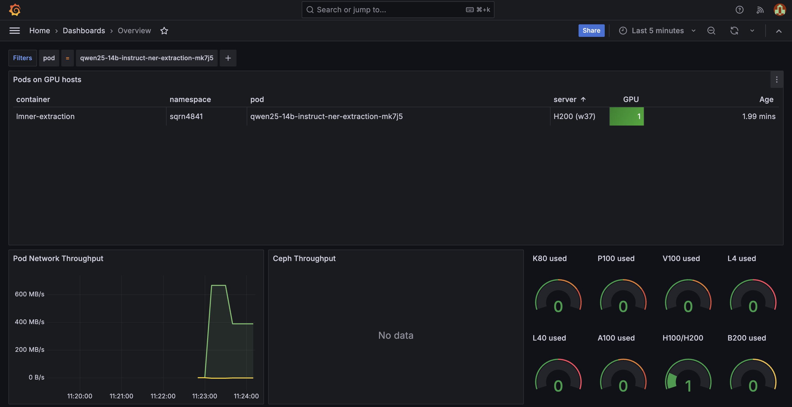

# Annotate Package

Annotate the scraped dataset using **Kubernetes** deployment of [Label Studio][label-studio-url] or **Generalist and Lightweight Model for Named Entity Recognition** ([GLiNER][gliner]) or using a Language Model (LMNER)

---

<div align = "center">

![Moonrepo][moonrepo-shield]
![UV][uv-shield]
![K8S][k8s-shield]
![HF Hub][gliner-hf-shield]
![HF Hub][qwen-hf-shield]
![HF Hub][phi-hf-shield]
![Docker Image Size][arxivflow-annotate-image-shield]
![Docker Image Size][arxivflow-annotate-sm-90-image-shield]

</div>

<div align = "center">



</div>

---

- Spin-up a containerized instance of [Label Studio][label-studio-url] to perform annotations of the dataset.
- Deployed Label Studio instance is connected to the `arxivflow-pvc`, ready for data annotation work package.
- Peform inter-annotator agreement check - human vs phi, human vs qwen, qwen vs phi
- Alternatively, run GLiNER zero-shot NER as a K8S job.
- We are using [`urchade/gliner_large-v2.1`][gliner-hf-url] _(459M paramateric DaROBERTa based bidirectional encoder architecture model for zero-shot Named Entity Recognition)_
- Alternatively, run Language Model _(LMNER)_ zero-shot prompt-based NER as a K8S job.
- We use the following LM for zero-shot prompt-based annotation:

|    Language Model     |  HuggingFace Model Name   | VRAM Required _(Weights exclusive)_ |
| :-------------------: | :-----------------------: | :---------------------------------: |
| Qwen 2.5 14B Instruct | Qwen/Qwen2.5-14B-Instruct |               29.6 GB               |
|    Microsoft phi 4    |      microsoft/phi-4      |               29.3 GB               |

---

## Task Management with Moon

The project uses [Moon](https://moonrepo.dev/) as a task runner and project manager, configured efficiently via `moon.yml`.

<div align = "center">



</div>

Run standard task commands from the workspace root:

```bash
moon run annotate:TASK_NAME
```

---

## Python Management with UV

We use [uv][uv-url] to manage Python dependencies seamlessly and blazingly fast. All requirements are safely pinned down in `uv.lock`.

- **Main dependencies** _(e.g., aiofiles, gliner, wandb)_ are declared in the `[project.dependencies]` array in `pyproject.toml`.
- **Development dependencies** _(e.g., black, ruff, pylint)_ are organized explicitly within the `[dependency-groups]` under `dev` section in `pyproject.toml`. IAA deps. are available under `dev` deps.
- **Optional dependencies** _(e.g. vLLM)_ is added as optional dependency as it is not installed on local and github workflow worker. Installation within Docker runner image is handled explicitly there.

---

## Environment Configuration

Configuration variables, secrets, and other runtime settings are loaded via an `.env` file. To set everything up correctly on a local machine, simply copy and adapt the sample file:

```bash
cp .env.example .env
```

Ensure your copied `.env` properties have real values filled in before executing any scripts.

---

## Structure

```bash
.
├── assets/                       # images and other repo assets used in the README
├── k8s/                          # Kubernetes manifests
│ ├── `gliner-ner-extraction.yml` # Kubernetes job/manifest for GLiNER NER extraction
│ ├── `label-studio.yml`          # Kubernetes deployment for Label Studio
│ ├── `phi-4-ner-extraction.yml`  # Kubernetes job/manifest for Phi-4 NER extraction
│ └── `qwen25-ner-extraction.yml` # Kubernetes job/manifest for Qwen 2.5 NER extraction
├── scripts/
│ └── `clean.sh`                  # cleanup helper for local or containerized runs
├── src/
│ ├── lib/
│ │ ├── ner/
│ │ │ ├── `__init__.py`           # package initializer for ner module
│ │ │ ├── `config.py`             # GLiNER / NER configuration values
│ │ │ ├── `gliner.py`             # GLiNER model and NER inference logic
│ │ │ ├── `lmner.py`              # Language Model NER inference logic
│ │ │ └── `schema.py`             # data schema for annotations
│ │ └── quality/
│ │   ├── `__init__.py`           # package initializer for quality module
│ │   ├── `config.py`             # IAA configuration values
│ │   └── `iaa.py`                # Inter-annotator agreement calculations
│ ├── `logs/`                     # directory for runtime logs and output artifacts
│ └── utils/
│   ├── `__init__.py`             # utilities package initializer
│   ├── `logger.py`               # logging setup and helpers
│   └── `path.py`                 # path utilities used across the package
├── `Dockerfile`                  # container image build for the annotate service(s)
├── `Dockerfile.tera`             # templated Dockerfile used by the moon build system
├── `README.md`                   # this package README
├── `moon.yml`                    # Moon task configuration
├── `pyproject.toml`              # Python project configuration and dependencies
└── `uv.lock`                     # pinned dependency lock for `uv`
```

---

## Dockerization & Moon `.tera` Templates

This package builds optimized, fully containerized production images using multi-stage Docker builds.

Moon is configured to scaffold our workspace using `.tera` templates (`Dockerfile.tera`). This enables Moon to programmatically construct isolated execution contexts by selectively copying specific configuration files (`pyproject.toml`, `uv.lock`) and scopes (`src/**/*`) prior to dependency resolutions. This significantly accelerates build steps using layer caching and allows pruning extraneous project files.

Nvidia image (`nvidia/cuda:13.0.0-runtime-ubuntu24.04`) is defined directly via the template build stages to prepare dependencies before shedding development packages entirely for an optimal runner. We use `nvidia/cuda:13.0.0-devel-ubuntu24.04` as the runner since it has CUDA libraries pre-installed.

Given, the available GPUs, we have two variants of Docker images:

NVIDIA Ada Lovelace L4 - Uses CUDA 13.0 and SM-89

<div align = "center">

<a href="https://hub.docker.com/r/dashaikh10/arxivflow-annotate" target="_blank" rel="noopener noreferrer">
    
</a>

</div>

NVIDIA Hooper H100 and H200 - Uses CUDA 13.0 and SM-90

<div align = "center">

<a href="https://hub.docker.com/r/dashaikh10/arxivflow-annotate-sm-90" target="_blank" rel="noopener noreferrer">
    
</a>

</div>

---

## Cluster Usage

### Label Studio

Run this to generate / update `Dockerfile` using `Dockerfile.tera` and package scaffold:

```bash
moon docker file annotate # Run from ArXivFlow workspace folder.
```

Build the ArXivFlow Annotate Docker image using the Moon template flow:

```bash
moon run annotate:dockerize # Run from ArXivFlow workspace folder.
```

NOTE: If building for H100/200 or B200 _(Both are overkill for these models!)_ we need to provide appropriate `CUDA_ARCH` parameter and preferablly a distinct image name:

```bash
# H100 / H200 -> sm-90 / 9.0
moon run annotate:dockerize-sm-90
```

Publish the latest arxiv-annotate image to DockerHub _(Running this command will run dockerize command automatically)_:

```bash
moon run annotate:publish # Run from ArXivFlow workspace folder.
```

```bash
docker push dashaikh10/arxivflow-annotate-sm90:latest
```

Copy `.env` to Kubernetes cluster namespace:

```bash
kubectl create secret generic annotate-env --from-env-file=./.env
```

Start the Label Studio deployment and service:

```bash
kubectl apply -f k8s/label-studio.yml
```

Once the service is up and running, connect to it locally using the command below.
You should then be able to access your Label Studio deployment at `http://localhost:8080`

```bash
kubectl port-forward svc/label-studio 8080:8080
```

Connect to ArXivFlow PVC

<div align = "center">





</div>

### NER using GLiNER Large 2.1

Run the GLiNER model job on a suitable GPU **_(We use NVIDIA L4 Ada Lovelace GDDR6 24GB VRAM)_** or CPU with enough RAM _(12 ~ 16 GB should be enough)_

```bash
kubectl apply -f k8s/gliner-ner-extraction.yml
```

Cleanup resources _(pod, job)_ after task completion:

```bash
kubectl delete -f k8s/label-studio.yml
```

```bash
kubectl delete -f k8s/gliner-ner-extraction.yml
```

### NER using Language Models (Qwen / Phi)

Run the Language Model job on a suitable GPU **_(We use NVIDIA L4 Ada Lovelace GDDR6 24GB VRAM and NVIDIA H1/200 Hopper GDDR6 80GB VRAM)_**

```bash
kubectl apply -f k8s/qwen25-ner-extraction.yml
```

```bash
kubectl apply -f k8s/phi-4-ner-extraction.yml
```

Cleanup resources _(pod, job)_ after task completion:

```bash
kubectl delete -f k8s/qwen25-ner-extraction.yml
```

```bash
kubectl delete -f k8s/phi-4-ner-extraction.yml
```

<div align = "center">




</div>

---

## Reference

```bibtex
@misc{qwen2.5,
    title = {Qwen2.5: A Party of Foundation Models},
    url = {https://qwenlm.github.io/blog/qwen2.5/},
    author = {Qwen Team},
    month = {September},
    year = {2024}
}

@article{qwen2,
      title={Qwen2 Technical Report},
      author={An Yang and Baosong Yang and Binyuan Hui and Bo Zheng and Bowen Yu and Chang Zhou and Chengpeng Li and Chengyuan Li and Dayiheng Liu and Fei Huang and Guanting Dong and Haoran Wei and Huan Lin and Jialong Tang and Jialin Wang and Jian Yang and Jianhong Tu and Jianwei Zhang and Jianxin Ma and Jin Xu and Jingren Zhou and Jinze Bai and Jinzheng He and Junyang Lin and Kai Dang and Keming Lu and Keqin Chen and Kexin Yang and Mei Li and Mingfeng Xue and Na Ni and Pei Zhang and Peng Wang and Ru Peng and Rui Men and Ruize Gao and Runji Lin and Shijie Wang and Shuai Bai and Sinan Tan and Tianhang Zhu and Tianhao Li and Tianyu Liu and Wenbin Ge and Xiaodong Deng and Xiaohuan Zhou and Xingzhang Ren and Xinyu Zhang and Xipin Wei and Xuancheng Ren and Yang Fan and Yang Yao and Yichang Zhang and Yu Wan and Yunfei Chu and Yuqiong Liu and Zeyu Cui and Zhenru Zhang and Zhihao Fan},
      journal={arXiv preprint arXiv:2407.10671},
      year={2024}
}

@misc{zaratiana2023gliner,
    title         = {GLiNER: Generalist Model for Named Entity Recognition using Bidirectional Transformer},
    author        = {Urchade Zaratiana and Nadi Tomeh and Pierre Holat and Thierry Charnois},
    year          = {2023},
    eprint        = {2311.08526},
    archivePrefix = {arXiv},
    primaryClass  = {cs.CL}
}
```

<!-- REFERENCES -->

[arxivflow-annotate-image-shield]: https://img.shields.io/docker/image-size/dashaikh10/arxivflow-annotate?style=flat&label=arxivflow-annotate
[arxivflow-annotate-sm-90-image-shield]: https://img.shields.io/docker/image-size/dashaikh10/arxivflow-annotate?style=flat&label=arxivflow-annotate-sm-90
[gliner]: https://urchade.github.io/GLiNER/
[gliner-hf-url]: https://huggingface.co/urchade/gliner_large-v2.1
[gliner-hf-shield]: https://img.shields.io/badge/urchade/gliner__large--v2.1-Informational?style=flat&logo=huggingface&labelColor=000&color=ffd21e
[k8s-shield]: https://img.shields.io/badge/Kubernetes-Informational?style=flat&logo=kubernetes&logoColor=326ce5&labelColor=fff&color=326ce5
[label-studio-url]: https://labelstud.io/
[qwen-hf-shield]: https://img.shields.io/badge/qwen/qwen2.5--14b--instruct-Informational?style=flat&logo=huggingface&labelColor=000&color=6950ef
[moonrepo-shield]: https://img.shields.io/badge/Moonrepo-Informational?style=flat&logo=moonrepo&labelColor=fff&color=%236f53f3
[phi-hf-shield]: https://img.shields.io/badge/microsoft/phi4-Informational?style=flat&logo=huggingface&labelColor=000&color=3fa9f5
[uv-shield]: https://img.shields.io/badge/UV-Informational?style=flat&logo=uv&labelColor=fff&color=%23de5fe9
[uv-url]: https://github.com/astral-sh/uv
