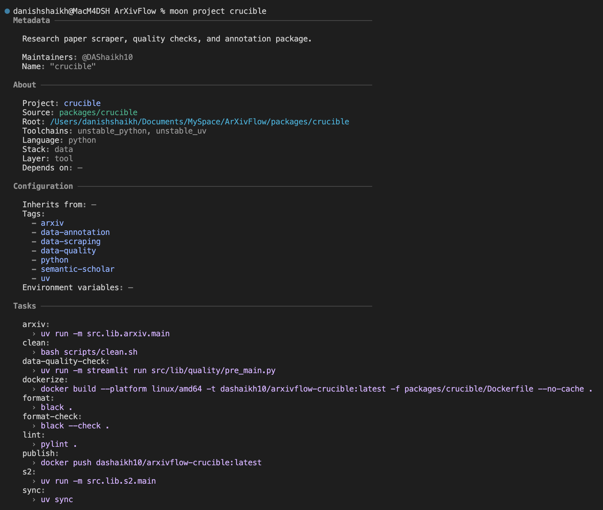
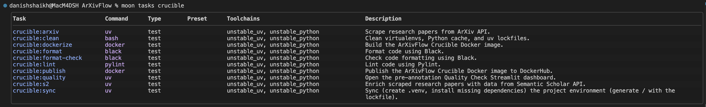

# Crucible Package

Scrape research papers from [ArXiv API][arxiv-api-url] and enrich their metadata using [Semantic Scholar API][semantic-scholar-api-url].

<div align = "center">

![Moonrepo][moonrepo-shield]
![UV][uv-shield]
![Docker Image Size][arxivflow-scarper-image-shield]

</div>

<div align = "center">



</div>

- Fetch research metadata from the [ArXiv API][arxiv-api-url] _(with built-in retry logic that respects usage guidelines)_.
- Enrich scraped research papers with [influential citations count][s2-influential-citation-count-url] and references from the [Semantic Scholar API][semantic-scholar-api-url] _(aka S2 API)_, strictly adhering to its 1 request per second limit with retry fallbacks.
- To remain memory-efficient while processing massive datasets, all operations are backed by structured logging and streaming file I/O.

## Task Management with Moon

The project uses [Moon](https://moonrepo.dev/) as a task runner and project manager, configured efficiently via `moon.yml`.

<div align = "center">



</div>

Run standard task commands from the workspace root:

```bash
moon run crucible:TASK_NAME
```

## Python Management with UV

We use [uv][uv-url] to manage Python dependencies seamlessly and blazingly fast. All requirements are safely pinned down in `uv.lock`.

- **Main dependencies** _(e.g., aiohttp, tqdm, tenacity)_ are declared in the `[project.dependencies]` array in `pyproject.toml`.
- **Development dependencies** _(e.g., black, ruff, pylint)_ are organized explicitly within the `[dependency-groups]` under `dev` section in `pyproject.toml`.

## Environment Configuration

Configuration variables, secrets, and other runtime settings are loaded via an `.env` file. To set everything up correctly on a local machine, simply copy and adapt the sample file:

```bash
cp .env.example .env
```

Ensure your copied `.env` properties have real values filled in before executing any scripts.

## Structure

```bash
.
├── k8s/ — Kubernetes manifests
│ ├── `scrape-arxiv-api.yml`  # Kubernetes job/manifest for scraping arXiv API
│ └── `scrape-s2-api.yml`     # Kubernetes job/manifest for scraping Semantic Scholar API
├── scripts/
│ └── `clean.sh`              # cleanup helper for local or containerized runs
├── src/
│ ├── lib/
│ │ ├── arxiv/
│ │ │ ├── `__init__.py`       # package initializer for arxiv module
│ │ │ ├── `arxiv.py`          # arXiv API client and scraping logic
│ │ │ ├── `config.py`         # arXiv-specific configuration values
│ │ │ ├── `main.py`           # arXiv scraper entrypoint
│ │ │ └── `schema.py`         # data schema for arXiv records
│ │ └── s2/
│ │ ├── `__init__.py`         # package initializer for s2 module
│ │ ├── `config.py`           # Semantic Scholar configuration
│ │ ├── `main.py`             # Semantic Scholar scraper entrypoint
│ │ └── `semantic_scholar.py` # Semantic Scholar API client and scraping logic
│ ├── `logs/`                 # directory for runtime logs and output artifacts
│ └── utils/
│ ├── `__init__.py`           # utilities package initializer
│ ├── `file_io.py`            # helpers for streaming file read-writes
│ ├── `logger.py`             # logging setup and helpers
│ └── `path.py`               # path utilities used across the package
├── `Dockerfile`              # container image build for the crucible service(s)
├── `Dockerfile.tera`         # templated Dockerfile used by the moon build system
├── `pyproject.toml`          # Python project configuration and dependencies
└── `README.md`               # this package README
```

## Dockerization & Moon `.tera` Templates

This package builds optimized, fully containerized production images using multi-stage Docker builds.

Moon is configured to scaffold our workspace using `.tera` templates (`Dockerfile.tera`). This enables Moon to programmatically construct isolated execution contexts by selectively copying specific configuration files (`pyproject.toml`, `uv.lock`) and scopes (`src/**/*`) prior to dependency resolutions. This significantly accelerates build steps using layer caching and allows pruning extraneous project files.

A minimal Python image (`ghcr.io/astral-sh/uv:python3.14-bookworm`) is defined directly via the template build stages to prepare dependencies before shedding development packages entirely for an optimal, lightweight Alpine-based runner (`python:3.14-alpine`).

## Cluster Usage

Build the ArXivFlow Crucible Docker image using the Moon template flow:

```bash
moon run crucible:dockerize # Run from ArXivFlow workspace folder.
```

Publish the latest arxiv-crucible image to DockerHub:

```bash
moon run crucible:publish # Run from ArXivFlow workspace folder.
```

Copy `.env` to Kubernetes cluster namespace:

```bash
kubectl create secret generic crucible-env --from-env-file=./.env
```

Run the scrape jobs individually, one after the other, as the S2 job requires a dataset prepared by the ArXiv scrape job:

```bash
kubectl apply -f k8s/scrape-arxiv-api.yml
```

```bash
kubectl apply -f k8s/scrape-s2-api.yml
```

Cleanup resources _(pod, job)_ after job completion:

```bash
kubectl delete -f k8s/scrape-arxiv-api.yml
```

```bash
kubectl delete -f k8s/scrape-s2-api.yml
```

<!-- REFERENCES -->

[arxiv-api-url]: https://info.arxiv.org/help/api/basics.html
[arxivflow-scarper-image-shield]: https://img.shields.io/docker/image-size/dashaikh10/arxivflow-crucible?style=flat&label=arxivflow-crucible
[moonrepo-shield]: https://img.shields.io/badge/Moonrepo-Informational?style=flat&logo=moonrepo&labelColor=fff&color=%236f53f3
[s2-influential-citation-count-url]: https://www.semanticscholar.org/faq/influential-citations
[semantic-scholar-api-url]: https://www.semanticscholar.org/product/api
[uv-shield]: https://img.shields.io/badge/UV-Informational?style=flat&logo=uv&labelColor=fff&color=%23de5fe9
[uv-url]: https://github.com/astral-sh/uv
