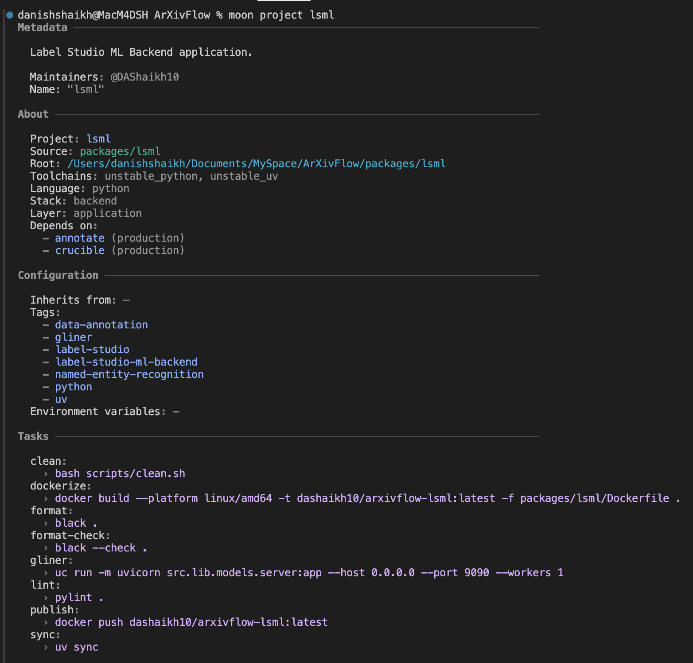
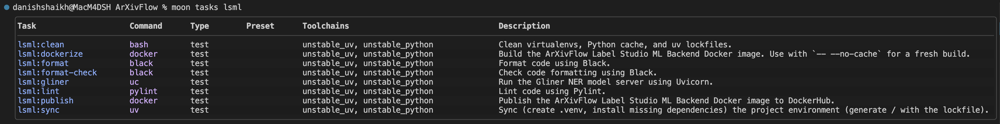
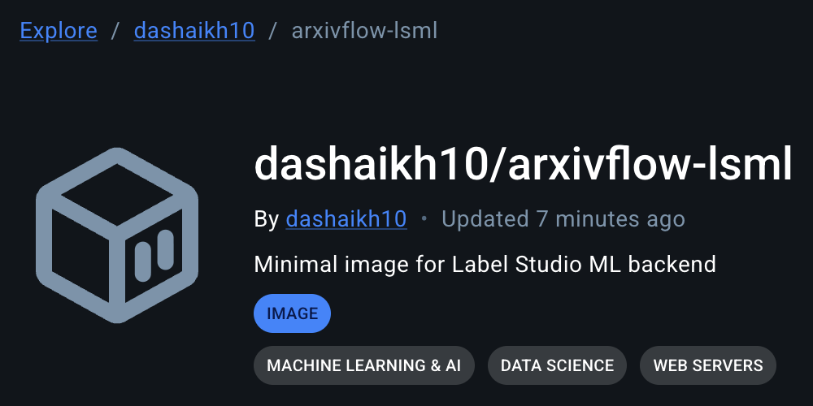
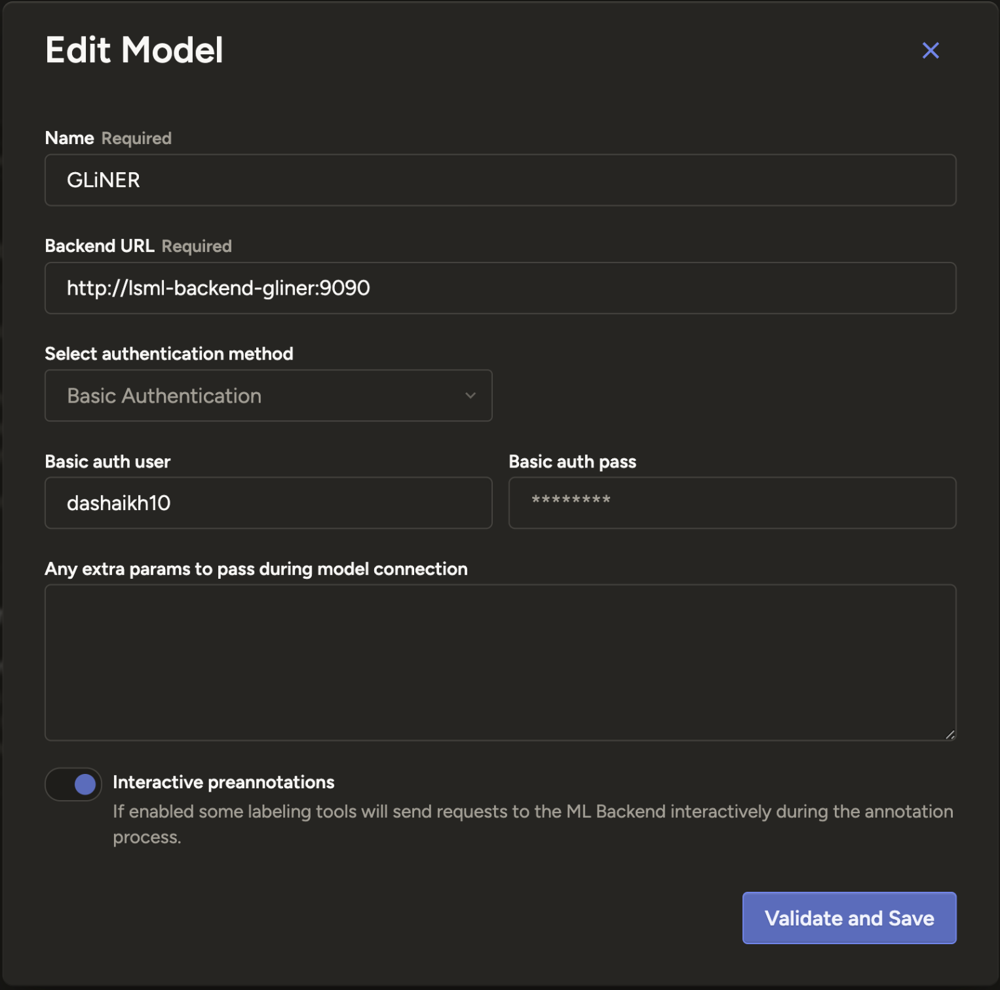

# LSML _(Label Studio Machine Learning)_ Package

Label Studio Machine Learning backend **Kubernetes** deployment to support annotation suggestions using **Generalist and Lightweight Model for Named Entity Recognition** ([GLiNER][gliner])

---

<div align = "center">

![Moonrepo][moonrepo-shield]
![UV][uv-shield]
![K8S][k8s-shield]
![HF Hub][gliner-hf-shield]
![Docker Image Size][arxivflow-lsml-image-shield]

</div>

<div align = "center">



</div>

---

- Label Studio Machine Learning backend for annotation assistance _(Suggests annotations)_
- There is an official [implementation][lable-studio-ml-url] available but we did **NOT** use it since it downloads the ML model per request!
- We adapt the original implementation to our requirements and migrated it to FastAPI _(Previously Flask)_ and to load the model only once per backend lifespan.
- Annotation suggestions powered by **Generalist and Lightweight Model for Named Entity Recognition** ([GLiNER][gliner])
- We are using [`urchade/gliner_large-v2.1`][gliner-hf-url] _(459M paramateric DaROBERTa based bidirectional encoder architecture model for zero-shot Named Entity Recognition)_

---

## Task Management with Moon

The project uses [Moon](https://moonrepo.dev/) as a task runner and project manager, configured efficiently via `moon.yml`.

<div align = "center">



</div>

Run standard task commands from the workspace root:

```bash
moon run lsml:TASK_NAME
```

---

## Python Management with UV

We use [uv][uv-url] to manage Python dependencies seamlessly and blazingly fast. All requirements are safely pinned down in `uv.lock`.

- **Main dependencies** _(e.g., fastapi, gliner, uvicorn)_ are declared in the `[project.dependencies]` array in `pyproject.toml`.
- **Development dependencies** _(e.g., black, ruff, pylint)_ are organized explicitly within the `[dependency-groups]` under `dev` section in `pyproject.toml`.

---

## Environment Configuration

Configuration variables, secrets, and other runtime settings are loaded via an `.env` file. To set everything up correctly on a local machine, simply copy and adapt the sample file:

```bash
cp .env.example .env
```

Ensure your copied `.env` properties have real values filled in before executing any scripts.

---

## Structure

```bash
.
├── assets/                             # documentation assets
├── k8s/ — Kubernetes manifests
│ └── `label-studio-backend-gliner.yml` # Kubernetes deployment/service manifest
├── scripts/
│ └── `clean.sh`                        # cleanup helper for local or containerized runs
├── src/
│ ├── `__init__.py`                     # package initializer
│ ├── `api.py`                          # API routing
│ ├── `schema.py`                       # definitions and models
│ ├── lib/
│ │ └── models/
│ │   ├── `__init__.py`                 # models package initializer
│ │   ├── `gliner_inference.py`         # GLiNER inference logic
│ │   ├── `model.py`                    # Label Studio ML model interface
│ │   └── `server.py`                   # backend server logic
│ ├── `logs/`                           # directory for runtime logs and output artifacts
│ └── utils/
│   ├── `__init__.py`                   # utilities package initializer
│   ├── `deps.py`                       # dependency injection utilities
│   └── `logger.py`                     # logging setup and helpers
├── `Dockerfile`                        # container image build for the lsml service
├── `Dockerfile.tera`                   # templated Dockerfile used by the moon build system
├── `moon.yml`                          # moonrepo task definitions
├── `pyproject.toml`                    # Python project configuration and dependencies
└── `README.md`                         # this package README
```

---

## Dockerization & Moon `.tera` Templates

This package builds optimized, fully containerized production images using multi-stage Docker builds.

Moon is configured to scaffold our workspace using `.tera` templates (`Dockerfile.tera`). This enables Moon to programmatically construct isolated execution contexts by selectively copying specific configuration files (`pyproject.toml`, `uv.lock`) and scopes (`src/**/*`) prior to dependency resolutions. This significantly accelerates build steps using layer caching and allows pruning extraneous project files.

A minimal Python image (`python3.14-slim`) is defined directly via the template build stages to prepare dependencies before shedding development packages entirely for an optimal, lightweight runner. We cannot use `alpine` here as it has no wheel for `onnx-runtime`.

<div align = "center">

<a href="https://hub.docker.com/r/dashaikh10/arxivflow-lsml" target="_blank" rel="noopener noreferrer">
    
</a>

</div>

---

## Cluster Usage

### Scrape

Run this to generate / update `Dockerfile` using `Dockerfile.tera` and package scaffold:

```bash
moon docker file lsml # Run from ArXivFlow workspace folder.
```

Build the ArXivFlow LSML Docker image using the Moon template flow:

```bash
moon run lsml:dockerize # Run from ArXivFlow workspace folder.
```

Publish the latest arxiv-lsml image to DockerHub _(Running this command will run dockerize command automatically)_:

```bash
moon run lsml:publish # Run from ArXivFlow workspace folder.
```

Copy `.env` to Kubernetes cluster namespace:

```bash
kubectl create secret generic lsml-env --from-env-file=./.env
```

Run the LSML GLiNER backend, run the following deployment:

```bash
kubectl apply -f k8s/label-studio-backend-gliner.yml
```

Use the following URL to connect to the Label Studio ML backend to Label Studio:

```txt
http://label-studio-ml-backend-gliner:9090
```

Add the following labelling information to the Label Studio Labelling instructions:

```html
<h2>Named Entity Recognition (NER) Labeling Task</h2>

<br />

<p>
  Your task is to identify and label named entities in academic paper abstracts to power a recommendation system.
</p>

<br />

<h3>Entity Types</h3>
<ul>
  <li><strong>nlp task</strong>: The specific task or problem being solved (e.g., "Machine Translation", "Sentiment Analysis")</li>
  <li><strong>model architecture</strong>: The structural design of the model (e.g., "Transformer", "Convolutional Neural Network")</li>
  <li><strong>algorithmic method</strong>: A technique or algorithm used in the process (e.g., "contrastive learning", "gradient descent")</li>
  <li><strong>evaluation dataset</strong>: Datasets or benchmarks used for testing (e.g., "SQuAD", "ImageNet", "WMT14")</li>
  <li><strong>application domain</strong>: The real-world field where this is applied (e.g., "healthcare", "autonomous driving", "finance")</li>
</ul>

<br />

<h3>How to Label</h3>
<ol>
  <li>Highlight text by clicking and dragging</li>
  <li>Select the appropriate entity type from the dropdown</li>
  <li>Review highlighted entities before saving</li>
</ol>

<br />

<h3>Examples</h3>
<p><strong>Correct:</strong> "We use a <i>Transformer</i> to improve <i>Named Entity Recognition</i>" → model architecture + nlp task</p>
<p><strong>Correct:</strong> "Evaluated on the <i>GLUE benchmark</i> for <i>clinical text</i>" → evaluation dataset + application domain</p>
<p><strong>Avoid:</strong> Labeling general or ambiguous phrases like "our novel model", "the main dataset"</p>

<br />

<h3>Guidelines</h3>
<ul>
  <li>Be consistent with capitalization and spacing when highlighting</li>
  <li>Label exact multi-word entities as one unit (e.g., "Generative Adversarial Network")</li>
  <li>Only highlight references explicitly present in the abstract text.</li>
</ul>
```

<div align = "center">



</div>

Cleanup resources _(pod, job)_ after task completion:

```bash
kubectl delete -f k8s/label-studio-backend-gliner.yml
```

---

## Reference

```bibtex
@misc{zaratiana2023gliner,
    title         = {GLiNER: Generalist Model for Named Entity Recognition using Bidirectional Transformer},
    author        = {Urchade Zaratiana and Nadi Tomeh and Pierre Holat and Thierry Charnois},
    year          = {2023},
    eprint        = {2311.08526},
    archivePrefix = {arXiv},
    primaryClass  = {cs.CL}
}
```

<!-- REFERENCES -->

[arxivflow-lsml-image-shield]: https://img.shields.io/docker/image-size/dashaikh10/arxivflow-lsml?style=flat&label=arxivflow-lsml
[gliner]: https://urchade.github.io/GLiNER/
[gliner-hf-shield]: https://img.shields.io/badge/urchade/gliner__large--v2.1-Informational?style=flat&logo=huggingface&labelColor=000&color=ffd21e
[gliner-hf-url]: https://huggingface.co/urchade/gliner_large-v2.1
[k8s-shield]: https://img.shields.io/badge/Kubernetes-Informational?style=flat&logo=kubernetes&logoColor=326ce5&labelColor=fff&color=326ce5
[label-studio-url]: https://labelstud.io/
[lable-studio-ml-url]: https://github.com/HumanSignal/label-studio-ml-backend/
[moonrepo-shield]: https://img.shields.io/badge/Moonrepo-Informational?style=flat&logo=moonrepo&labelColor=fff&color=%236f53f3
[uv-shield]: https://img.shields.io/badge/UV-Informational?style=flat&logo=uv&labelColor=fff&color=%23de5fe9
[uv-url]: https://github.com/astral-sh/uv
