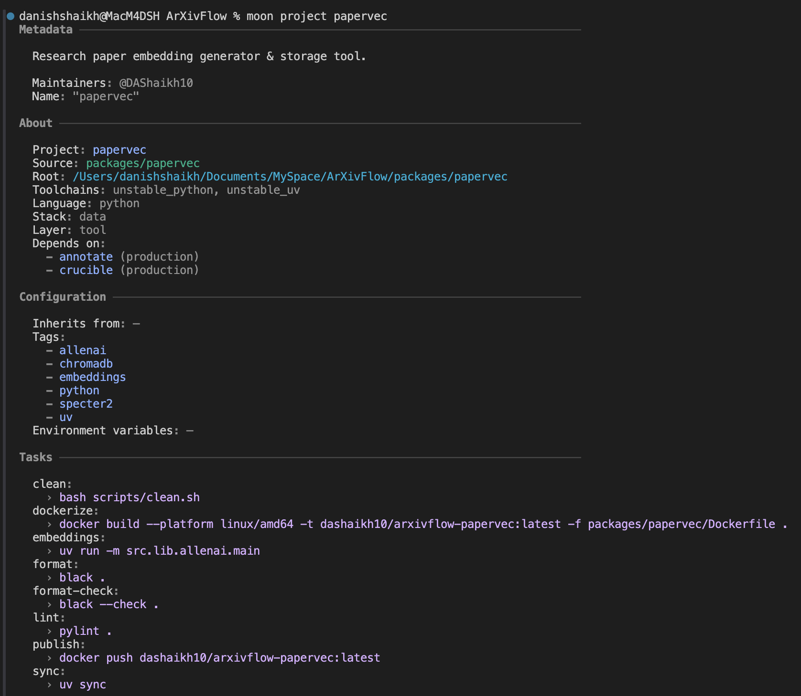
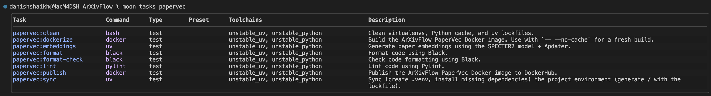
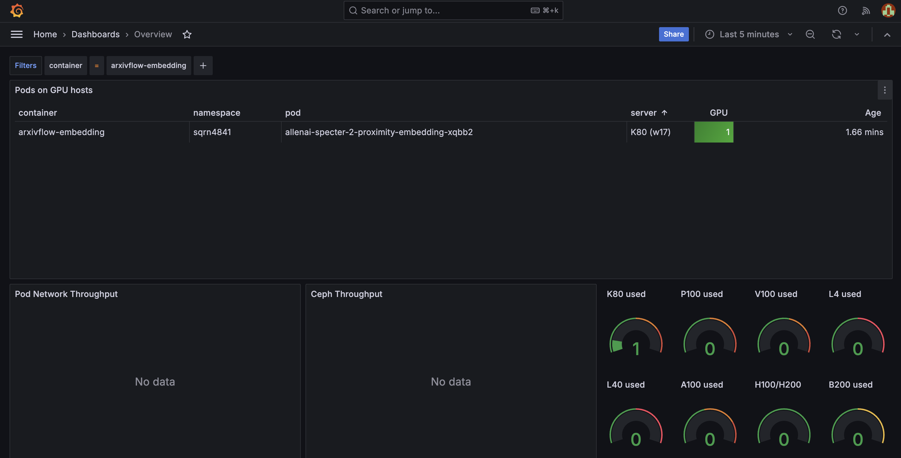

# PaperVec Package

Generate the vector embeddings for the research papers using [Allen AI/SPECTER2][allenai-specter2-url] with Proximity Adapter _(Parameter-Efficient Fine-Tuning for Retrieval task)_ and save in-memory [ChromaDB][chromadb-url] with canonical tags / labels.

---

<div align = "center">

![Moonrepo][moonrepo-shield]
![UV][uv-shield]
![K8S][k8s-shield]
![HF Hub][specter2-hf-shield]
![Docker Image Size][arxivflow-papervec-image-shield]

</div>

<div align = "center">



</div>

---

- Generate vector embeddings for the research papers using Allen AI's [SPECTER2][specter2-gh-url] with Proximity Adapter model
- These generated embeddings are then stored into the ChromaDB with metadata tags prepared using human-annotations
- We adhere to the SPECTER2 training paradigm of using cosine similarity _(With Hierarchical Navigable Small World)_

---

## Task Management with Moon

The project uses [Moon](https://moonrepo.dev/) as a task runner and project manager, configured efficiently via `moon.yml`.

<div align = "center">



</div>

Run standard task commands from the workspace root:

```bash
moon run papervec:TASK_NAME
```

---

## Python Management with UV

We use [uv][uv-url] to manage Python dependencies seamlessly and blazingly fast. All requirements are safely pinned down in `uv.lock`.

- **Main dependencies** _(e.g., adapters, chromadb, wandb)_ are declared in the `[project.dependencies]` array in `pyproject.toml`.
- **Development dependencies** _(e.g., black, ruff, pylint)_ are organized explicitly within the `[dependency-groups]` under `dev` section in `pyproject.toml`.

---

## Environment Configuration

Configuration variables, secrets, and other runtime settings are loaded via an `.env` file. To set everything up correctly on a local machine, simply copy and adapt the sample file:

```bash
cp .env.example .env
```

Ensure your copied `.env` properties have real values filled in before executing any scripts.

---

## Structure

```bash
.
├── assets/                       # images and other repo assets used in the README
├── k8s/                          # Kubernetes manifests
│ └── `specter2-embeddings.yml`   # Kubernetes job/manifest for SPECTER2 embeddings
├── scripts/
│ └── `clean.sh`                  # cleanup helper for local or containerized runs
├── src/
│ ├── lib/
│ │ └── allenai/
│ │   ├── `__init__.py`           # package initializer for allenai module
│ │   ├── `config.py`             # configuration values
│ │   ├── `main.py`               # main entry point
│ │   ├── `specter.py`            # SPECTER2 embedding logic
│ │   └── `tags.py`               # canonical tags logic
│ ├── `logs/`                     # directory for runtime logs and output artifacts
│ └── utils/
│   ├── `__init__.py`             # utilities package initializer
│   ├── `logger.py`               # logging setup and helpers
│   └── `path.py`                 # path utilities used across the package
├── `Dockerfile`                  # container image build for the papervec service(s)
├── `Dockerfile.tera`             # templated Dockerfile used by the moon build system
├── `README.md`                   # this package README
├── `moon.yml`                    # Moon task configuration
├── `pyproject.toml`              # Python project configuration and dependencies
└── `uv.lock`                     # pinned dependency lock for `uv`
```

---

## Dockerization & Moon `.tera` Templates

This package builds optimized, fully containerized production images using multi-stage Docker builds.

Moon is configured to scaffold our workspace using `.tera` templates (`Dockerfile.tera`). This enables Moon to programmatically construct isolated execution contexts by selectively copying specific configuration files (`pyproject.toml`, `uv.lock`) and scopes (`src/**/*`) prior to dependency resolutions. This significantly accelerates build steps using layer caching and allows pruning extraneous project files.

A minimal Python image (`python3.14-slim`) is defined directly via the template build stages to prepare dependencies before shedding development packages entirely for an optimal, lightweight Alpine-based runner.

---

## Cluster Usage

Run this to generate / update `Dockerfile` using `Dockerfile.tera` and package scaffold:

```bash
moon docker file papervec # Run from ArXivFlow workspace folder.
```

Build the ArXivFlow PaperVec Docker image using the Moon template flow:

```bash
moon run papervec:dockerize # Run from ArXivFlow workspace folder.
```

Publish the latest arxiv-papervec image to DockerHub _(Running this command will run dockerize command automatically)_:

```bash
moon run papervec:publish # Run from ArXivFlow workspace folder.
```

Copy `.env` to Kubernetes cluster namespace:

```bash
kubectl create secret generic papervec-env --from-env-file=./.env
```

### Embedding Generation using SPECTER2

Before running the kubectl jobs we need to copy over the human annotations and canonical tags onto the **arxivflow-pvc**.

```bash
kubectl cp ./data/human-annotations.json arxivflow-pvc-inspector:/data/arxivflow/data/ # Run from ArXivFlow workspace folder.
```

```bash
kubectl cp ./data/canonical_map.json arxivflow-pvc-inspector:/data/arxivflow/data/ # Run from ArXivFlow workspace folder.
```

Run the SPECTER2 model job on a suitable GPU **_(We use NVIDIA L4 Ada Lovelace GDDR6 24GB VRAM)_** or CPU is also enough.

```bash
kubectl apply -f k8s/specter2-embeddings.yml
```

Cleanup resources _(pod, job)_ after task completion:

```bash
kubectl delete -f k8s/specter2-embeddings.yml
```

<div align = "center">



</div>

---

## Reference

```bibtex
@inproceedings{Singh2022SciRepEvalAM,
  title={SciRepEval: A Multi-Format Benchmark for Scientific Document Representations},
  author={Amanpreet Singh and Mike D'Arcy and Arman Cohan and Doug Downey and Sergey Feldman},
  booktitle={Conference on Empirical Methods in Natural Language Processing},
  year={2022},
  url={https://api.semanticscholar.org/CorpusID:254018137}
}
```

<!-- REFERENCES -->

[arxivflow-papervec-image-shield]: https://img.shields.io/docker/image-size/dashaikh10/arxivflow-papervec?style=flat&label=arxivflow-papervec
[chromadb-url]: https://www.trychroma.com/
[specter2-gh-url]: https://github.com/allenai/SPECTER2
[specter2-hf-shield]: https://img.shields.io/badge/allenai/specter2-Informational?style=flat&logo=huggingface&labelColor=000&color=7a1fa2
[k8s-shield]: https://img.shields.io/badge/Kubernetes-Informational?style=flat&logo=kubernetes&logoColor=326ce5&labelColor=fff&color=326ce5
[label-studio-url]: https://labelstud.io/
[moonrepo-shield]: https://img.shields.io/badge/Moonrepo-Informational?style=flat&logo=moonrepo&labelColor=fff&color=%236f53f3
[allenai-specter2-url]: https://allenai.org/blog/specter2-adapting-scientific-document-embeddings-to-multiple-fields-and-task-formats-c95686c06567
[uv-shield]: https://img.shields.io/badge/UV-Informational?style=flat&logo=uv&labelColor=fff&color=%23de5fe9
[uv-url]: https://github.com/astral-sh/uv
